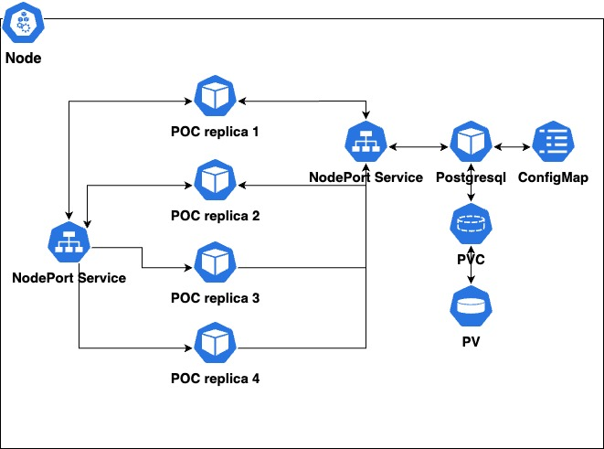

# Optimistic and pessimistic locking proof of concept

Optimistic and pessimistic locking are techniques used to avoid conflicts that arise when multiple instances or threads of an application attempt to access or update the same data simultaneously. This proof of concept (POC) was created to simulate the conditions in which these conflicts could occur and demonstrate how to avoid them using one or both approaches depending on the situation.

This POC is a Java-based project was built using Spring Boot 3 and needs JDK 17 to be compiled and run.

The microservice will be scaled horizontally into a Kubernetes cluster having four instances to provide the right conditions to demonstrate the behavior described before. The files dblockingpoc.yaml and postgresql_pod.yaml include all the configurations required for deployment. 

The following diagram depicts the Kubernetes cluster. 



## Deploying service

1. Build docker image
```shell
gradle bootBuildImage
```
2. Deploying postgresql database
```shell
kubectl apply -f postgresql_pod.yaml
```
3. Deploying service with 4 replicas
```shell
kubectl apply -f dblockingpoc.yaml
```
# Resources

* [Deploying postgres to kubernetes](https://adamtheautomator.com/postgres-to-kubernetes/)
* [Spring transaction management](https://docs.spring.io/spring-framework/docs/current/reference/html/data-access.html#transaction)
* [Baeldung optimistic locking](https://www.baeldung.com/jpa-optimistic-locking)
* [Baeldung pessimistic locking](https://www.baeldung.com/jpa-pessimistic-locking)
